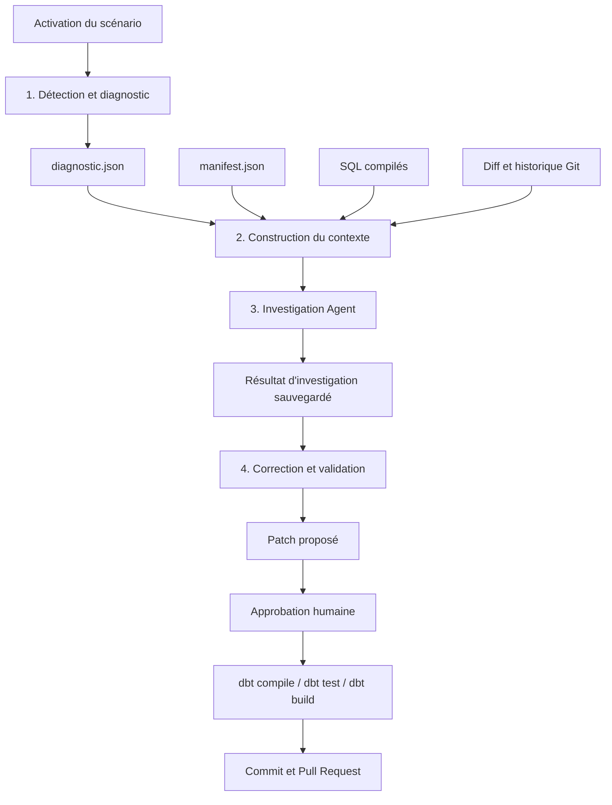

# Agentic Data Quality Platform

Plateforme de démonstration **Agentic Data Quality** : détection déterministe (SQL/dbt), investigation agentique (Google ADK), proposition de correction, observabilité Langfuse.

## Stack

| Composant | Version |
|---|---|
| Python | 3.12 |
| DuckDB | 1.5.5 |
| dbt-core | 1.11.14 |
| dbt-duckdb | 1.11.0 |
| google-adk | 2.8.0 |
| Gemini | gemini-3.5-flash |
| Langfuse | 4.x |
| Streamlit | 1.63+ |

## Architecture

```text
Data Generator → DuckDB (raw) → dbt (staging/int/marts)
                                      ↓
                              SQL DQ Checks (déterministe)
                                      ↓
                              Investigation Agent (ADK)
                                      ↓
                              Correction Agent (ADK)
                                      ↓
                              Human approval → GitHub PR
```

**Principe** : les règles déterministes détectent ; les agents investiguent et proposent ; l'humain contrôle le merge.

## Pipeline `dbt_failure_pipeline`

Le pipeline de traitement des échecs dbt est organisé en quatre étapes :



### 1. Détection et diagnostic

- `run_dbt_build()` exécute le projet dbt et détecte l'échec.
- `run_diagnostic()` lit `run_results.json` et produit `diagnostic.json`.
- Phase déterministe : aucun appel LLM.

### 2. Construction du contexte d'investigation

- `build_investigation_context()` assemble les quatre sources :
  `diagnostic.json`, `manifest.json`, SQL compilés et historique Git.
- Le manifeste est filtré sur le nœud en échec et ses dépendances directes.
- Les SQL compilés et l'historique Git couvrent le modèle en échec et ses parents.

### 3. Investigation Agent

- `run_investigation(incident_id)` injecte le contexte déterministe dans le prompt.
- `investigation_agent` est appelé une seule fois et n'utilise aucun tool.
- L'agent produit le résultat d'investigation, la confiance et les modèles affectés, sans modifier le dépôt.

### 4. Correction et validation

- `run_correction(incident_id)` appelle le `correction_agent` après revue du résultat d'investigation.
- L'agent appelle `get_dbt_model`, puis `propose_patch` pour un seul fichier autorisé.
- Après approbation humaine, `run_fix_pipeline()` applique le patch et lance
  `dbt compile`, `dbt test` et, si nécessaire, `dbt build`.
- Si les validations réussissent, un commit et une Pull Request sont créés.

## Quick start

```bash
python -m venv .venv
.venv\Scripts\activate          # Windows
pip install -e ".[dev]"

set DUCKDB_PATH=data/warehouse.duckdb
dbt build --project-dir dbt --profiles-dir dbt

streamlit run src/dq_platform/app/business_dashboard.py   # Dashboard métier
streamlit run src/dq_platform/app/dq_dashboard.py         # Monitoring DQ
```

## MCD interactif des marts

Le MCD des cinq modèles de `dbt/models/2_marts` est généré depuis le manifest dbt :

```bash
python scripts/render_marts_mcd.py
```

Le fichier `dbt/target/marts_mcd.html` est autonome. Dans Cursor ou VS Code,
lance la commande `Simple Browser: Show` puis ouvre ce fichier (ou utilise
`http://localhost:8765/marts_mcd.html` après avoir démarré
`python -m http.server 8765 --directory dbt/target`). La vue permet de zoomer,
déplacer le diagramme, rechercher une table et consulter ses colonnes,
son grain et ses relations.

Zensical peut servir à publier une documentation contenant une capture ou un
lien vers ce MCD, mais ce n'est pas le moteur de diagramme interactif. Le HTML
local est donc la vue d'exploration directement utilisable dans l'IDE.

## Anomalies injectées

Voir [docs/anomalies.md](docs/anomalies.md) pour la ground truth des 10 anomalies.

## Data Quality (SQL)

```bash
dq-run-checks                   # Exécute les checks SQL déterministes
```

## Agentic dbt Failure Investigator (MVP)

Nouveau module `src/dbt_failure_pipeline/` — investigation des échecs `dbt build` uniquement.

```bash
python scripts/bootstrap_warehouse.py
set DUCKDB_PATH=data/warehouse.duckdb
dbt build --project-dir dbt --profiles-dir dbt

dbt-activate-scenario SC001          # Active un scénario de panne + crée un incident
dbt-run-diagnostic                   # Diagnostic déterministe depuis run_results.json
dbt-run-investigation                # Diagnostic déterministe + agents ADK (Investigation → Correction)
streamlit run src/dbt_failure_pipeline/app/streamlit_app.py

dbt-eval-scenarios                   # Évalue SC001–SC010 (classification, sans LLM en CI)
dbt-reset-scenario                 # Restaure le baseline dbt
```

Scénarios reproductibles : `scenarios/SC001` … `SC010` avec ground truth YAML.

## Agent investigation (DQ platform)

Configurer `.env` (copier depuis `.env.example`) :

```bash
GOOGLE_API_KEY=...
LANGFUSE_PUBLIC_KEY=...
LANGFUSE_SECRET_KEY=...
```

```bash
dq-investigate                  # Détection + investigation + proposition
```

## Structure

```text
src/dq_platform/
  quality/       # Runner SQL déterministe
  agents/        # Investigation + Correction (ADK)
  tools/         # Tools ADK (lecture + propose_patch)
  orchestration/ # Pipeline Python
  app/           # Streamlit (métier + DQ)
  store/         # Tables dq_* dans DuckDB
dbt/             # Projet dbt-duckdb
quality/sql_checks/  # Checks SQL versionnés
docs/anomalies.md    # Ground truth
```

## Tests

```bash
pytest
ruff check src tests
```

## Garde-fous

- Détection : 100 % SQL/dbt (pas de LLM)
- Investigation : tools lecture seulement
- Correction : `propose_patch` uniquement (pas de merge auto)
- Branches : `fix/dq-*` uniquement
- Merge : humain uniquement
