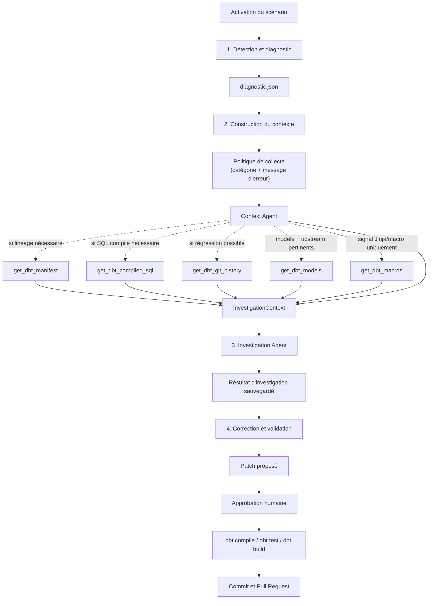

# Agentic Data Quality Platform

Plateforme de démonstration **Agentic Data Quality** : détection déterministe (SQL/dbt), investigation agentique (Google ADK), proposition de correction, observabilité Langfuse.

## Stack

| Composant | Version |
|---|---|
| Python | 3.12 |
| DuckDB | 1.5.5 |
| dbt-core | 1.11.14 |
| dbt-duckdb | 1.11.0 |
| google-adk | 2.8.0 |
| Gemini | gemini-3.5-flash |
| Langfuse | 4.x |
| Streamlit | 1.63+ |

## Architecture

```text
Data Generator → DuckDB (raw) → dbt (staging/int/marts)
                                      ↓
                              SQL DQ Checks (déterministe)
                                      ↓
                              Context Agent (ADK)
                                      ↓
                              Investigation Agent (ADK)
                                      ↓
                              Correction Agent (ADK)
                                      ↓
                              Human approval → GitHub PR
```

**Principe** : les règles déterministes détectent ; les agents investiguent et proposent ; l'humain contrôle le merge.

## Pipeline `dbt_failure_pipeline`

Le pipeline de traitement des échecs dbt est organisé en quatre étapes :



### 1. Détection et diagnostic

- `run_dbt_build()` exécute le projet dbt et détecte l'échec.
- `run_diagnostic()` lit `run_results.json` et produit `diagnostic.json`.
- Phase déterministe : aucun appel LLM.

### 2. Construction du contexte d'investigation

- Le pipeline transmet `diagnostic.json` au `context_agent` et construit une
  politique de collecte à partir de la catégorie et du message d'erreur.
- Le Context Agent ne relit pas `diagnostic.json` avec un tool : il choisit
  uniquement les tools requis ou explicitement justifiés par cette politique.
- `get_dbt_manifest` est utilisé pour la lineage, `get_dbt_compiled_sql` pour
  les erreurs SQL, `get_dbt_git_history` pour les régressions et
  `get_dbt_models` uniquement pour le modèle en erreur et les upstream utiles.
- `get_dbt_macros` est interdit par défaut et n'est appelé qu'en présence d'un
  signal Jinja ou macro.
- `sources_used` conserve les tools appelés et `tool_reasons` explique
  pourquoi chaque tool a été sélectionné.
- Le résultat est validé comme `InvestigationContext` avant d'être transmis à
  l'agent d'investigation.

Le contrat minimal du contexte transmis à l'`Investigation Agent` est :

```json
{
  "diagnostic": {},
  "manifest": {},
  "compiled_sql": {},
  "git": {},
  "models": {},
  "macros": {},
  "lineage": {},
  "sources_used": [],
  "tool_reasons": {}
}
```

Les champs correspondant aux tools non appelés restent vides. Le contexte est
ensuite compacté pour éviter de transmettre deux fois le même SQL lorsque le
manifest et `get_dbt_models` contiennent une information identique.

### 3. Investigation Agent

- `run_investigation(incident_id)` appelle d'abord le Context Agent, puis injecte
  son contexte structuré dans le prompt.
- `investigation_agent` est appelé une seule fois après la construction du contexte
  et n'utilise aucun tool.
- L'agent produit le résultat d'investigation, la confiance et les modèles affectés, sans modifier le dépôt.

### 4. Correction et validation

- `run_correction(incident_id)` appelle le `correction_agent` après revue du résultat d'investigation.
- L'agent appelle `get_dbt_model`, puis `propose_patch` pour un seul fichier autorisé.
- Après approbation humaine, `run_fix_pipeline()` applique le patch et lance
  `dbt compile`, `dbt test` et, si nécessaire, `dbt build`.
- Si les validations réussissent, un commit et une Pull Request sont créés.

## Quick start

```bash
python -m venv .venv
.venv\Scripts\activate          # Windows
pip install -e ".[dev]"

set DUCKDB_PATH=data/warehouse.duckdb
dbt build --project-dir dbt --profiles-dir dbt

dq-api                                                       # API du dashboard React
```

### Dashboard React (module 2)

Le dashboard métier est désormais disponible via une API FastAPI et un frontend
Vite/React :

```bash
dq-api
cd frontend
npm install
npm run dev
```

Pour lancer le frontend dans Docker :

```bash
docker build -t dq-platform-frontend ./frontend
docker run --rm -p 8080:80 dq-platform-frontend
```

Lancez l'API avec `dq-api` sur le port `8000`, puis ouvrez
`http://localhost:8080`. Nginx relaie automatiquement `/api` vers l'API
FastAPI de l'hôte.

Pour lancer l'API et le frontend ensemble avec Docker Compose :

```bash
docker compose up --build
```

Le frontend est accessible sur `http://localhost:8080` et l'API sur
`http://localhost:8000`.

L'interface interroge les marts et expose un assistant métier. Le chat transmet
le contexte du graphique et des filtres à un routeur d'intentions puis au
Context Agent hybride. `GOOGLE_API_KEY` est nécessaire pour obtenir des
réponses agentiques ; les graphiques restent disponibles sans cette clé.

## MCD interactif des marts

Le MCD des cinq modèles de `dbt/models/2_marts` est généré depuis le manifest dbt :

```bash
python scripts/render_marts_mcd.py
```

Le fichier `dbt/target/marts_mcd.html` est autonome. Dans Cursor ou VS Code,
lance la commande `Simple Browser: Show` puis ouvre ce fichier (ou utilise
`http://localhost:8765/marts_mcd.html` après avoir démarré
`python -m http.server 8765 --directory dbt/target`). La vue permet de zoomer,
déplacer le diagramme, rechercher une table et consulter ses colonnes,
son grain et ses relations.

Zensical peut servir à publier une documentation contenant une capture ou un
lien vers ce MCD, mais ce n'est pas le moteur de diagramme interactif. Le HTML
local est donc la vue d'exploration directement utilisable dans l'IDE.

## Agentic dbt Failure Investigator (MVP)

Nouveau module `src/dbt_failure_pipeline/` — investigation des échecs `dbt build` uniquement.

```bash
python scripts/bootstrap_warehouse.py
set DUCKDB_PATH=data/warehouse.duckdb
dbt build --project-dir dbt --profiles-dir dbt

dbt-activate-scenario SC001          # Active un scénario de panne + crée un incident
dbt-run-diagnostic                   # Diagnostic déterministe depuis run_results.json
dbt-run-investigation                # Diagnostic déterministe + agents ADK (Investigation → Correction)
streamlit run src/dbt_failure_pipeline/app/streamlit_app.py

dbt-eval-scenarios                   # Évalue SC001–SC010 (classification, sans LLM en CI)
dbt-reset-scenario                 # Restaure le baseline dbt
```

Scénarios reproductibles : `scenarios/SC001` … `SC036` avec ground truth YAML.
La taxonomie par difficulté et la matrice complète sont décrites dans
[docs/dbt_failure_scenarios.md](docs/dbt_failure_scenarios.md).

### Règles de décision pour les corrections

Une erreur de qualité de données ou de référentiel ne bloque pas automatiquement
la proposition d'un patch dbt. L'agent vérifie d'abord si une correction SQL
locale est démontrable, sans inventer de données ni modifier la sémantique
métier. Cela couvre par exemple une fonction invalide, une colonne cassée mais
inutile, un alias incorrect ou une transformation SQL clairement erronée.

L'agent classe un incident comme `Source data issue` uniquement lorsque les
preuves montrent que des enregistrements sources nécessaires sont absents, que
la source est incomplète ou désynchronisée, ou qu'une décision du propriétaire
de la source est nécessaire. Dans ce cas, il ne propose pas de modification de
modèle dbt, recommande une correction de la source ou une revue humaine et
place l'incident en `needs_human`.

Un simple échec de test `relationships`, `not_null` ou de qualité des données
ne suffit donc pas à déclencher ce blocage. L'investigation doit expliquer
pourquoi une transformation dbt ne peut pas corriger le problème avant de
refuser un patch.

## Structure

```text
src/dq_platform/
  agents/        # Agent Q&A métier (ADK)
  tools/         # Tools ADK en lecture seule
  orchestration/ # Routage et chat
  api/            # API FastAPI du dashboard
  services/       # Requêtes de données
dbt/             # Projet dbt-duckdb
frontend/        # Dashboard React
```

## Tests

```bash
pytest
ruff check src tests
```

## Garde-fous

- Détection : 100 % SQL/dbt (pas de LLM)
- Investigation : tools lecture seulement
- Correction : `propose_patch` uniquement (pas de merge auto)
- Branches : `fix/dq-*` uniquement
- Merge : humain uniquement
