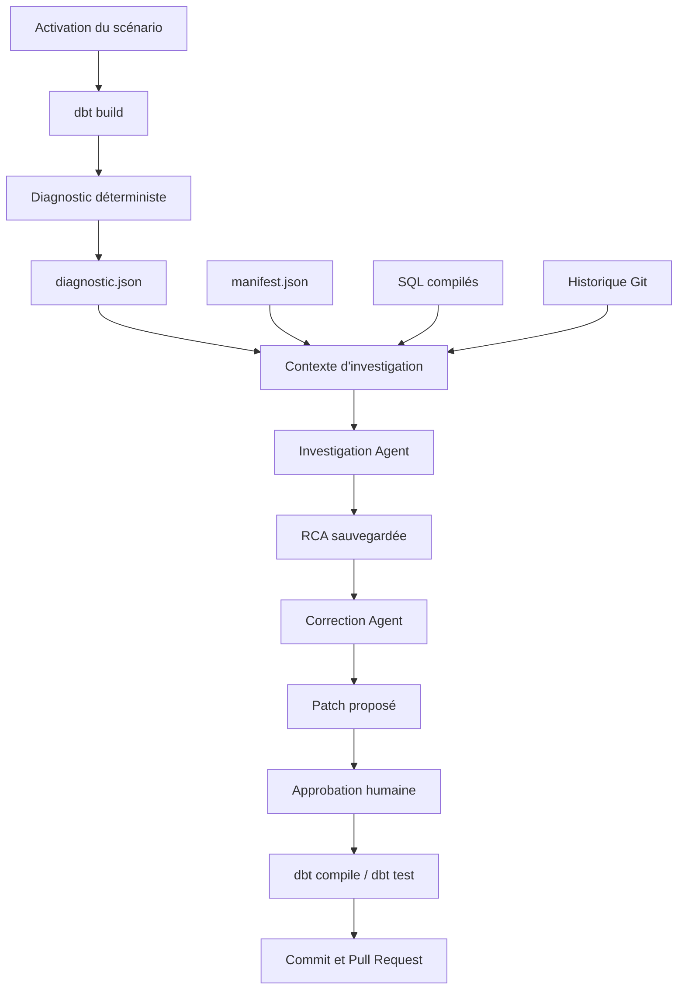

# Agentic Data Quality Platform

Plateforme de démonstration **Agentic Data Quality** : détection déterministe (SQL/dbt), investigation agentique (Google ADK), proposition de correction, observabilité Langfuse.

## Stack

| Composant | Version |
|---|---|
| Python | 3.12 |
| DuckDB | 1.5.5 |
| dbt-core | 1.11.14 |
| dbt-duckdb | 1.11.0 |
| google-adk | 2.8.0 |
| Gemini | gemini-3.5-flash |
| Langfuse | 4.x |
| Streamlit | 1.63+ |

## Architecture

```text
Data Generator → DuckDB (raw) → dbt (staging/int/marts)
                                      ↓
                              SQL DQ Checks (déterministe)
                                      ↓
                              Investigation Agent (ADK)
                                      ↓
                              Correction Agent (ADK)
                                      ↓
                              Human approval → GitHub PR
```

**Principe** : les règles déterministes détectent ; les agents investiguent et proposent ; l'humain contrôle le merge.

## Pipeline `dbt_failure_pipeline`

Le pipeline de traitement des échecs dbt est séparé en étapes indépendantes :



### Détection et diagnostic

`run_dbt_build()` exécute le projet dbt. En cas d'échec, `run_diagnostic()`
lit `dbt/target/run_results.json` et produit `dbt/target/diagnostic.json`.
Cette phase est entièrement déterministe et ne fait appel à aucun LLM.

Le diagnostic contient le `unique_id` des nœuds en échec, leur type, leur
chemin de modèle et leur message d'erreur.

### Contexte d'investigation

`build_investigation_context()` prépare un contexte à partir de quatre sources
uniquement :

1. `dbt/target/diagnostic.json` ;
2. `dbt/target/manifest.json`, limité au nœud en échec et aux nœuds référencés
   directement dans `depends_on.nodes` ;
3. les SQL compilés du nœud en échec et de ses parents directs ;
4. le diff de travail et l'historique Git récent du modèle en échec.

Ce contexte est injecté dans le prompt. L'Investigation Agent n'a plus de
tools à appeler : une investigation correspond donc à un seul appel LLM. Il
produit une analyse de cause racine sans modifier le dépôt.

### Correction séparée

`run_investigation(incident_id)` s'arrête après la RCA et place l'incident dans
l'état `INVESTIGATED`.

Après revue de cette analyse, `run_correction(incident_id)` lance séparément le
Correction Agent. Celui-ci propose un patch limité à un fichier autorisé et
place l'incident dans l'état `AWAITING_APPROVAL`.

### Approbation et validation

`run_fix_pipeline()` n'est exécuté qu'après approbation humaine. Il applique le
patch, exécute `dbt compile` et `dbt test`, puis crée un commit et une Pull
Request si la validation réussit. Une validation échouée nécessite une revue
humaine.

## Quick start

```bash
python -m venv .venv
.venv\Scripts\activate          # Windows
pip install -e ".[dev]"

set DUCKDB_PATH=data/warehouse.duckdb
dbt build --project-dir dbt --profiles-dir dbt

streamlit run src/dq_platform/app/business_dashboard.py   # Dashboard métier
streamlit run src/dq_platform/app/dq_dashboard.py         # Monitoring DQ
```

## Anomalies injectées

Voir [docs/anomalies.md](docs/anomalies.md) pour la ground truth des 10 anomalies.

## Data Quality (SQL)

```bash
dq-run-checks                   # Exécute les checks SQL déterministes
```

## Agentic dbt Failure Investigator (MVP)

Nouveau module `src/dbt_failure_pipeline/` — investigation des échecs `dbt build` uniquement.

```bash
python scripts/bootstrap_warehouse.py
set DUCKDB_PATH=data/warehouse.duckdb
dbt build --project-dir dbt --profiles-dir dbt

dbt-activate-scenario SC001          # Active un scénario de panne + crée un incident
dbt-run-diagnostic                   # Diagnostic déterministe depuis run_results.json
dbt-run-investigation                # Diagnostic déterministe + agents ADK (Investigation → Correction)
streamlit run src/dbt_failure_pipeline/app/streamlit_app.py

dbt-eval-scenarios                   # Évalue SC001–SC010 (classification, sans LLM en CI)
dbt-reset-scenario                 # Restaure le baseline dbt
```

Scénarios reproductibles : `scenarios/SC001` … `SC010` avec ground truth YAML.

## Agent investigation (DQ platform)

Configurer `.env` (copier depuis `.env.example`) :

```bash
GOOGLE_API_KEY=...
LANGFUSE_PUBLIC_KEY=...
LANGFUSE_SECRET_KEY=...
```

```bash
dq-investigate                  # Détection + investigation + proposition
```

## Structure

```text
src/dq_platform/
  quality/       # Runner SQL déterministe
  agents/        # Investigation + Correction (ADK)
  tools/         # Tools ADK (lecture + propose_patch)
  orchestration/ # Pipeline Python
  app/           # Streamlit (métier + DQ)
  store/         # Tables dq_* dans DuckDB
dbt/             # Projet dbt-duckdb
quality/sql_checks/  # Checks SQL versionnés
docs/anomalies.md    # Ground truth
```

## Tests

```bash
pytest
ruff check src tests
```

## Garde-fous

- Détection : 100 % SQL/dbt (pas de LLM)
- Investigation : tools lecture seulement
- Correction : `propose_patch` uniquement (pas de merge auto)
- Branches : `fix/dq-*` uniquement
- Merge : humain uniquement
